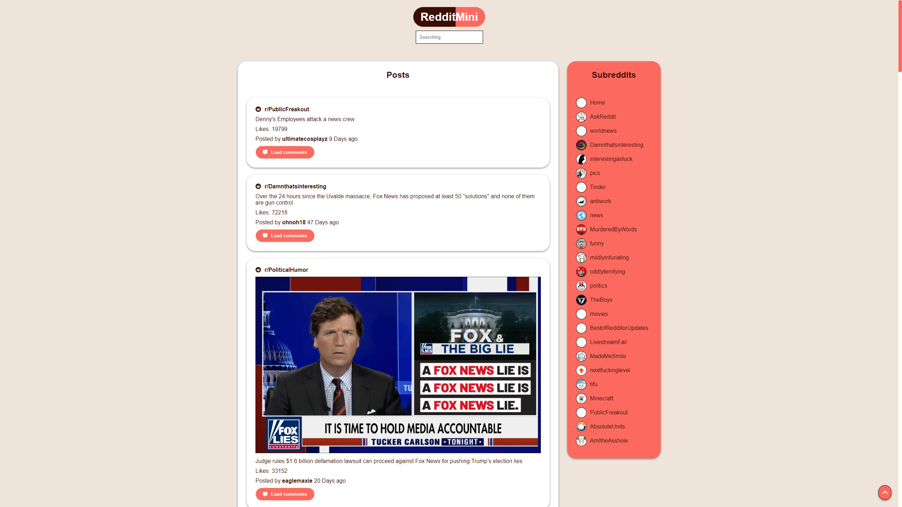
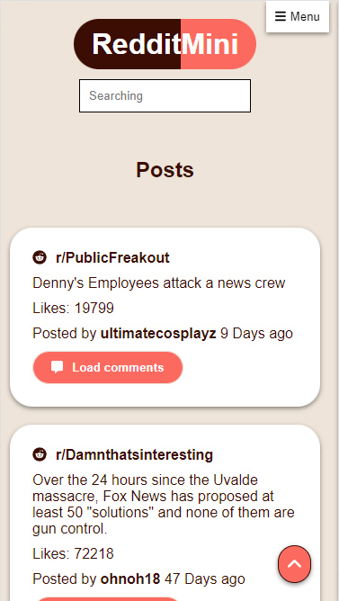

# RedditMini

👋 Hi, I’m @Jason-Smith-Code

👀 I’m interested in

- Programming (Javascript)
- Gaming ( RTS, FPS & ARPG's)

📫 How to reach me
https://www.linkedin.com/in/jason-smith-code/

## Application Description

## Objective

## What was my Workflow

- **✅ Research Reddit**  

- **✅ Write up the idea of the project**  

- **✅ Decide on colour palette for the theme**  
  Coolors.co is a fantastic App to choose colours for a theme, testing combinations and contrast decided to go with purple hues and picked some cold and warm variations to separate foreground and background. 
  You can see my colour theme [here](https://coolors.co/69009e-9e0091-ff00b1-c2a5bc-c1e9f1).

- **✅ Create a wireframe of Taskify**  
  Used wireframing tool [FIGMA](https://www.figma.com/) to plan out my application. 
  You can see the results of that work [here](src/images/screenShots/Figma.jpg)

- **✅ Use github for version control**  
  Set up repository on github, and accessed it locally to start work using git commands to regularly add, commit, and push changes to the repository.

- **✅ Install packages**  
  I had an idea what packages I was going to work with based on the features I wanted to include. Working with React, Jest for testing, redux toolkit for state management.

- **✅ Setup file structure**  
  For this project I used create-react-app, I re-organised the file structure and began adding javascript files.

- **✅ Create search**  

- **✅ Implement Layout and theme**  
  Working from the wireframe I began to build the layout of the application then apply the colour theme.

- **✅ Build the menu**  
- **Test application**  
  Testing started.

- **✅ Add Mobile, tablet and desktopp optimisation**  
  I want the application to look great on all mobile, tablet and desktop, I used a mobile first css approach.

- **✅ Create a build and deploy to github pages**  
  To showcase this application, I will use github pages as its free and easy to setup.

## Screen Shots

Main Page : Desktop

Main Page : Mobile

## Viewing the application

Visit : https://jason-smith-code.github.io/reddit-mini/

## Project status

Currently the project is at version 1.0.0
